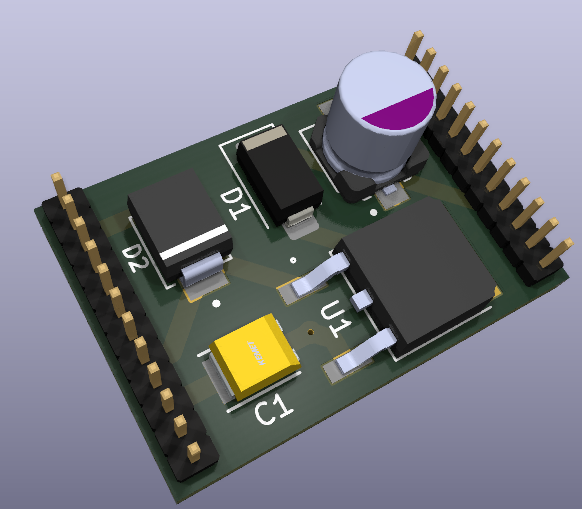

# Nanoka DC-DC Power Module

This was the first version of Nanoka's power module that adapts 6V-30V to 5V, which the board needs to work. It's based on a simple low-dropout regulator. These resisitive-type regulators don't do switching to step down voltage so they're relatively noise free, which is important for audio circuits. They also have noise filtering properties. 

Initially, this was intended to go inside a car (hence the TVS diode) but I soon realized that it's a horrible idea to fit this in a car. It will probably work until a load dump spike kills it. 

Outside of automotive applications however, this is suitable, and it allows you to power the Nanoka audio board from a wide range of DC power supplies. 

None of this is tested, however, and if you build one of these, you do so *at your own responsibility*! 

