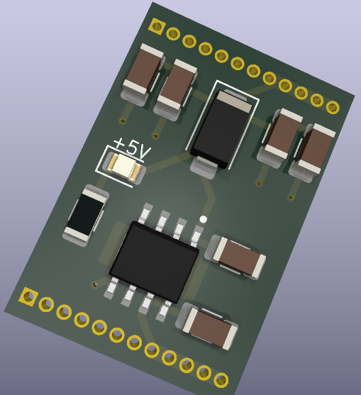

# Nanoka DC-DC Power Module

This is the second revision of a power module designed for Project Nanoka. It's based on an automotive grade low-dropout regulator (TPS7B8650). The initial version was based on a non-automotive grade regulator, which is fine when not used in a car's harsh electrical environment. But this project was intended to be used in a car, so I had to design something better. 

The TPS7B8650 is on the expensive side, but it has many necessary measures built-in, such as:
1. Protection against load dumps and alternator spikes
2. Excellent response to transients on the input
3. minimal output overshoot from dropout

With these built-in, it's much simpler for me (the hobbyist) to design something that won't catch fire. At minimum, the fixed-voltage version only needs two capacitors to function. But this board also includes a backflow protection diode and four buffer capacitors to keep the device it powers on if there are momentary dropouts. 

I have yet to build and test this, so whether it works and performs well remains to be seen. That said, this is probably useful only to me, but if you do decide to reproduce it, *all responsibility is yours*!

